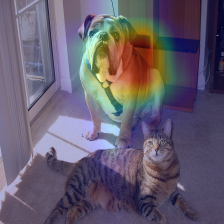
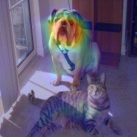
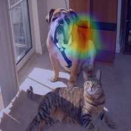
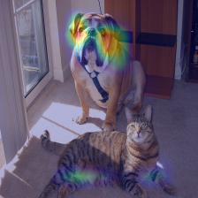
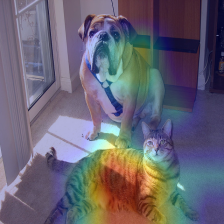
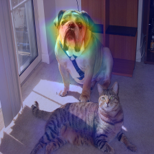
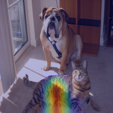
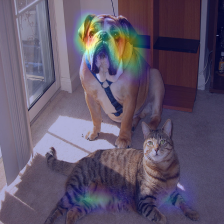

# Real Time CNN Visualization

This is a platform for real time visualization of Convolutional Neural Networks.

The aim of the platform is to be a handful tool for interactive quick analysis of networks.

Activation maps of convolutional layers as well activations of fully connected layer are visualized. Visualized activations can be clicked interactively for applying more advance visualization techniques to corresponding neurons.

The FPS is in the order of magnitude (\*~0.4) of the FPS of the visualized network. The latter is achieved by creating a single graph for all the visualizations in such a way that given an input frame all the required visualizations in certain moment of time are obtained on the GPU by single pass through the graph without backward and forward data communications with the GPU.


## Requirements

* [Docker](https://docs.docker.com/install/linux/docker-ce/ubuntu/)

It is recommended to run on GPU, as with the CPU version the FPS will be very low. To run on GPU, also the following is required.  

* Recent NVIDIA drivers (`nvidia-384` on Ubuntu)
* [NVIDIA Docker](https://github.com/NVIDIA/nvidia-docker )


## Usage
### GPU version
```
docker build -t basecv . # Build Docker image which contains all the requirements
docker run  --runtime nvidia --env DISPLAY=$DISPLAY -v="/tmp/.X11-unix:/tmp/.X11-unix:rw"  -v=$(pwd)/.keras:/root/.keras  -v="$(pwd)/..:$(pwd)/.." -w=$(pwd) -it  basecv python3 main.py --stream "your/stream/uri"
```

### CPU version

```
docker build -t basecv -f Dockerfile.cpu . # Build Docker image which contains all the requirements
docker run  --env DISPLAY=$DISPLAY -v="/tmp/.X11-unix:/tmp/.X11-unix:rw"  -v=$(pwd)/.keras:/root/.keras  -v="$(pwd)/..:$(pwd)/.." -w=$(pwd) -it  basecv python3 main.py --stream "your/stream/uri"
```


`python3 main.py -h # Gives information on available parameters`

```
usage: main.py [-h] [--stream STREAM] [--network NETWORK]

optional arguments:
  -h, --help         show this help message and exit
  --stream STREAM    Video stram URI, path to video or webcam number based on
                     which the network is visualized
  --network NETWORK  Network to visualise (VGG16,ResNet50 ...)
```
<!-- #### With Docker Compose

```
docker-compose build
docker-compose run vis#### With pure Docker
``` -->
<!-- #### With pure Docker -->
### Troubleshooting

#### Could not connect to any X display.

The X Server should allow connections from a docker container.

Run `xhost +local:docker`, also check [this](https://forums.docker.com/t/start-a-gui-application-as-root-in-a-ubuntu-container/17069)

## Visualization Algorithms
Currently available:
* [Grad-CAM](https://arxiv.org/abs/1610.02391 "Grad-CAM: Visual Explanations from Deep Networks via Gradient-based Localization")
* [Guided Backprop](https://arxiv.org/abs/1412.6806 "Striving for Simplicity: The All Convolutional Net")

Extendable with other algorithms, required computation for which is in the order of magnitude of forward/backward pass through the network.


## Apply Algorithms to Still Images

Visualization algorithms reside in single files and can be applied to still images

```
$ python3 gradcam.py -h

usage: gradcam.py [-h] [-i INPUT] [-o OUTPUT] [-n NETWORK]
                  [--convindex CONVINDEX]

optional arguments:
  -h, --help            show this help message and exit
  -i INPUT, --input INPUT
                        Input image
  -o OUTPUT, --output OUTPUT
                        Output Image
  -n NETWORK, --network NETWORK
                        Network (VGG16,ResNet50 ...)
  --convindex CONVINDEX
                        Index of convolutional layer to use in the algorithm
                        (-1 for last layer)

```

<table border=0 >
	<tbody>
    <tr>
  		<td>  </td>
  		<td align="center" colspan="2"> Last Convolutional Layer </td>
  		<td align="center" colspan="2"> Last-1 Convolutional Layer </td>
  	</tr>
    <tr>
  		<td>  </td>
  		<td align="center"> ResNet50 </td>
  		<td align="center"> VGG16 </td>
  		<td align="center"> ResNet50</td>
  		<td align="center"> VGG16</td>
  	</tr>
		<tr>
			<td width="16%" align="center"> Top-1 </td>
			<td width="21%" >  </td>
			<td width="21%" >  </td>
			<td width="21%" >  </td>
			<td width="21%" >  </td>
		</tr>
		<tr>
			<td width="16%" align="center"> Top-2 </td>
			<td width="21%" >  </td>
			<td width="21%" >  </td>
			<td width="21%" >  </td>
			<td width="21%" >  </td>
		</tr>
	</tbody>
</table>
